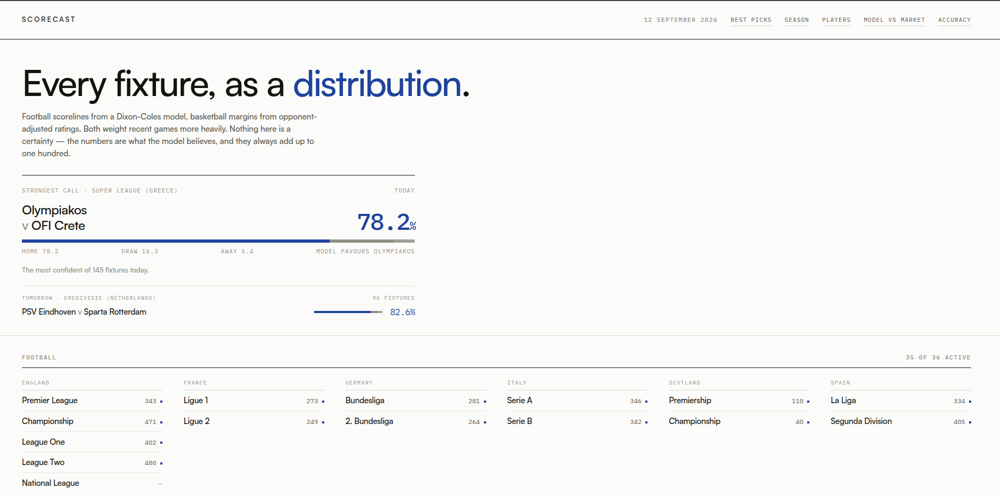

# ScoreCast



Match prediction for **36 football leagues** and **two basketball competitions**, scored
honestly against the bookmakers' closing price.

🐳 **Run it yourself:** `docker compose up` — see [Deployment](#deployment).

---

## What it does

Football fixtures are predicted with a **Dixon-Coles Poisson model** fitted per league;
EuroLeague and EuroCup use **opponent-adjusted ridge regression** on margin and total,
because basketball scores are normal rather than Poisson. For every football fixture:

- Win / Draw / Loss probabilities
- Expected goals for each team
- Full scoreline distribution (0-0 through 5-5)
- Most likely score and top three scorelines
- Both Teams to Score %
- Over 1.5 / 2.5 / 3.5 goals %

### Model vs Market

The part most prediction sites leave out. `benchmark.py` replays completed seasons
walk-forward — fitting only on matches before each fixture — and scores the model
against the **de-vigged closing odds** on log loss and Brier score, with a reliability
diagram for calibration.

The market wins. It should: closing odds aggregate far more information than a goals
model has. The gap is published rather than hidden, because a prediction tool that
cannot say how wrong it is cannot be checked. Accuracy is deliberately not the headline
figure — a model that says 90% and is right 60% of the time can still look accurate.

## Coverage

**36 leagues**, from one registry in `Scripts/leagues.py`:

| Region | Leagues |
|---|---|
| England | Premier League, Championship, League One, League Two, National League |
| Spain | La Liga, Segunda División |
| Italy | Serie A, Serie B |
| Germany | Bundesliga, 2. Bundesliga |
| France | Ligue 1, Ligue 2 |
| Scotland | Premiership, Championship |
| Rest of Europe | Netherlands, Portugal, Belgium, Greece, Turkey, Poland, Romania, Russia, Austria, Switzerland, Denmark, Norway, Sweden, Finland, Ireland |
| Americas & Asia | Brazil Série A, Argentina, MLS, Liga MX, J1 League, Chinese Super League |
| Basketball | EuroLeague, EuroCup |

## Features

- **Best Picks** — the model's most confident calls, grouped by date
- **Model vs Market** — log loss and Brier vs de-vigged closing odds, plus calibration
- **Season Projection** — every remaining fixture simulated 10,000 times for title, European and relegation odds
- **Head to Head** — historical meetings between any two clubs
- **Simulator** — any two teams from any league, fitted on request
- **Rankings** — model strength vs actual table, with over- and under-performers
- **Team DNA** — attack/defence ratings, form, goals scored and conceded
- **Players** — EuroLeague and EuroCup scoring, rebounding and shooting leaders

## How it works

```
FootballData.py  →  fixtures.py  →  ScorelineModel.py  →  Flask web app
football-data     ESPN / FBref        Dixon-Coles           serves
   results         calendars          Poisson fit         predictions
```

1. **Results** — `FootballData.py` pulls all 36 leagues from football-data.co.uk in about
   30 seconds over plain HTTP. This replaced an 8.3-hour Cloudflare-blocked browser scrape.
2. **Calendars** — `fixtures.py` adds full-season kickoff times from ESPN and FBref via
   [soccerdata](https://github.com/probberechts/soccerdata). football-data publishes only
   the coming week.
3. **Model** — attack and defence parameters per club by maximum likelihood (L-BFGS-B),
   with exponential time decay (`DECAY_RATE = 0.0020`, a **347-day half-life**) and the
   Dixon-Coles low-score correction for 0-0, 1-0, 0-1 and 1-1. The decay rate was tuned
   against held-out seasons, not chosen by eye.
4. **Projection** — `simulate_season.py` plays out the rest of the season 10,000 times,
   sampling scorelines rather than outcomes so goal difference moves correctly.

### A note on derived fixtures

Where a published calendar runs short, the remaining fixtures are filled in — but only
for leagues **measured** to play a clean double round-robin, never assumed. Two tests
must both pass: past seasons must show every club playing exactly 2(n−1) games, and the
current season's progress must be arithmetically consistent with that total.

The second test exists because assuming the format once fabricated a title race. It is
what stops the Chinese Super League — which lists 28 clubs where its history shows 16 —
from having five hundred fixtures invented for it. Conference and Apertura/Clausura
leagues (MLS, Argentina, Liga MX) are left with a genuine gap instead, which is the
better failure.

## Running locally

```bash
git clone https://github.com/Costasgk/ScoreCast.git
cd ScoreCast
python -m venv env
source env/bin/activate          # Windows: env\Scripts\activate
pip install -r requirements.txt

python Scripts/refresh.py        # fetch, fit, predict, project
python Scripts/WebApp/app.py     # http://127.0.0.1:5000
```

`refresh.py` is the one command to run after time away. It fetches results and
calendars, refits all 36 leagues, predicts basketball and projects the remaining
seasons — and aborts without touching anything if the fetch fails, so a bad run leaves
yesterday's predictions in place rather than replacing them with nothing.

```bash
python Scripts/refresh.py --quick         # fetch and predict only
python Scripts/refresh.py --full          # also rescore against closing odds (slow)
python Scripts/refresh.py --install-cron  # print a crontab line
```

## Deployment

The container **serves** data; it does not fetch it. Scraping needs Chrome and
soccerdata, and both stay on whatever machine produces the CSVs — so the image carries
no browser, is a fraction of the size, and cannot break when a source changes its markup.

```bash
docker compose up -d          # http://127.0.0.1:8000
```

`Datasets/` is bind-mounted read-only, so refreshing predictions never needs a rebuild.
The app runs unprivileged as UID 10001, and its health check requests a real page so an
empty data mount reports unhealthy rather than merely alive.

Stats pages **fail closed**: with no `STATS_USERNAME` / `STATS_PASSWORD` set they return
503 rather than serving openly. Set `SCORECAST_OPEN_STATS=1` to allow anonymous access
on a trusted machine.

## Project structure

```
Scripts/
├── leagues.py           # single league registry — everything reads this
├── FootballData.py      # results for 36 leagues (~30s)
├── fixtures.py          # ESPN + FBref season calendars
├── ScorelineModel.py    # Dixon-Coles fit and prediction
├── simulate_season.py   # 10k-run Monte Carlo season projection
├── benchmark.py         # walk-forward scoring vs closing odds
├── refresh.py           # one command to update everything
├── Euroleague_scripts/  # EuroLeague and EuroCup ratings
└── WebApp/              # Flask app, templates, static

Datasets/                # git-ignored (large)
├── Cleaned Datasets/    # per-league match history
├── Predictions/         # upcoming fixture predictions
└── Models/              # fitted parameters, calendars, benchmark (JSON)
```

Legacy files from the original random-forest classifier (`Modelling.py`,
`LabelEncoding.py`, `Helper.py`, `Scrapping.py`, `Cleaning.py`) are kept for reference.

## Limitations

- The closing line beats this model on every league benchmarked. The gap is published.
- About 18% of fixtures involve a promoted club with no record in its new division;
  these are rated as an average side, which is a guess rather than a rating.
- Play-offs and championship splits are not modelled, so projections for those leagues
  describe the regular season only and are labelled as such.
- Shots and shots-on-target are present in the data but unused — the model reads goals.

## License

MIT — free to use, modify, and distribute.
