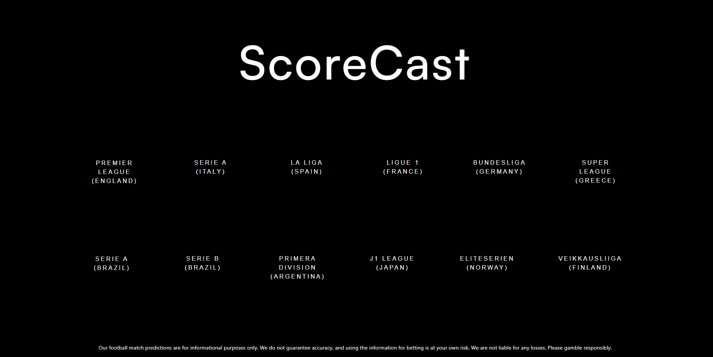

# ScoreCast - Football Game Outcome Predictor

**ScoreCast**  is an open-source web application designed to predict the outcomes of football games in twelve diverse football leagues, providing comprehensive coverage of the global football landscape. Our platform now includes predictions for some of the most popular and competitive leagues in Europe, such as the Premier League England, Serie A Italy, La Liga Spain, Ligue 1 France, Bundesliga Germany, and Super League Greece. Powered by a DecisionTreeClassifier model, ScoreCast provides users with valuable insights into which team is likely to win or lose a match, aiding football enthusiasts and bettors in making well-informed decisions for a wide range of matches across different continents and football cultures.

## Features

- Accurate Predictions: ScoreCast utilizes machine learning to analyze historical match data and make reliable predictions for upcoming games.
- User-friendly Interface: The intuitive web interface allows users to input match details and instantly receive outcome predictions.
- Multiple Leagues: ScoreCast now covers a broader range of football leagues, including top-tier leagues like the Premier League England, Serie A Italy, La Liga Spain, Ligue 1 France, Bundesliga Germany, and Super League Greece, in addition to the existing leagues from    Brazil, Argentina, Japan, Norway, and Finland.
- Ongoing Development: We believe in continuous improvement, and ScoreCast is an open-source project open to contributions from the community.

## How it Works

ScoreCast **scrapes data** from [FBREF](https://fbref.com/en/) to gather crucial information on team performance and player statistics. This data is then fed into a trained **DecisionTreeClassifier model**, which evaluates various factors to predict the likelihood of a win or loss for each team.

## Deployment

ScoreCast is deployed on AWS, ensuring a seamless and reliable user experience. The app was developed using Flask, a lightweight and versatile web framework, allowing for efficient handling of predictions and smooth navigation.

## Getting Started

To use ScoreCast, simply visit our website at [http://scorecast-env.eba-dixbcmhw.eu-central-1.elasticbeanstalk.com/](scorecast-env.eba-dixbcmhw.eu-central-1.elasticbeanstalk.com/) and follow the straightforward instructions to obtain game predictions. For developers interested in contributing or enhancing the app, check out our [contribution guidelines](CONTRIBUTING.md) to get started.

## Future Goals

We have exciting plans for the future development of ScoreCast. Here are some key areas we intend to focus on:

1. **Enhance Model Accuracy**: Continuously improve the prediction model to achieve even higher precision and reliability. Explore the adoption of state-of-the-art machine learning techniques and fine-tune algorithms for optimal results.

2. **Expand Data Sources**: Add support for additional football leagues and leverage a broader range of comprehensive and up-to-date data to bolster predictions.

3. **Efficiency Improvements**: Optimize data scraping and processing pipelines for faster and more efficient updates, ensuring timely and accurate insights.

4. **Advanced Prediction Models**: Investigate and implement cutting-edge machine learning models to elevate prediction accuracy to new levels.

5. **User Interface Refinement**: Enhance the user interface to offer a seamless and intuitive experience, empowering users with valuable insights into match outcomes.

## Share Your Ideas

We welcome ideas and suggestions from the community. If you have any feature requests or improvements in mind, feel free to open an issue or start a discussion in the GitHub Issues section.

We're committed to making ScoreCast the best football game outcome predictor, and your feedback and contributions play a crucial role in achieving that goal.

## License

ScoreCast is released under the [MIT License](LICENSE), making it free and open for everyone to use, modify, and distribute.

## Support and Contact

For any questions, feedback, or support, please feel free to reach out to us at costascg9@gmail.com or through our GitHub repository's [issues section](link_to_issues).
[Telegram] (https://t.me/blackouttips)
---

Join us in revolutionizing football game predictions with ScoreCast! Whether you're a sports enthusiast or a data science enthusiast, there's a place for you in our growing community of contributors. Let's score the future together!

**Disclaimer:** ScoreCast predictions are made based on historical data and statistical analysis. While our model aims to provide accurate predictions, we cannot guarantee the outcome of any football match. Users are encouraged to use predictions responsibly and for entertainment purposes only.

